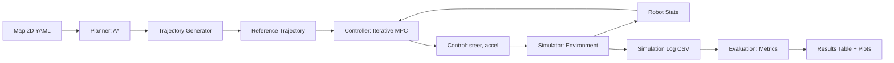
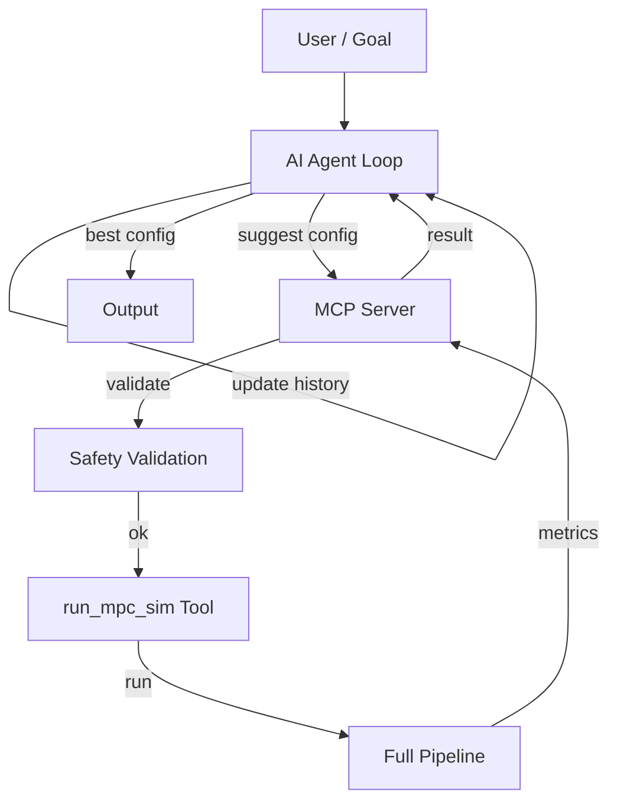

# ARCHITECTURE — Kiến trúc hệ thống

## Tổng quan

Hệ thống gồm 6 module chính, được thiết kế theo nguyên tắc separation of concerns:

```
Input → Planner → Controller → Simulator → Evaluation → Output
                          ↑          ↑
                       Agent ←→ MCP Server
```

## Sơ đồ luồng dữ liệu



## Sơ đồ AI Agent + MCP



## Module Responsibilities

### 1. planner/
- **A* search** trên grid map 2D (4/8-connected)
- **Trajectory generation**: chuyển discrete path → time-parameterized (t, x, y, yaw, v)
- **Smoothing**: moving average để trajectory mượt hơn

### 2. controller/
- **VehicleModel**: kinematic bicycle model, hàm `step()` và `linearize()`
- **IterativeMPC**: tuyến tính hóa lặp, giải QP bằng CVXPY
- Fallback proportional controller khi solver không hội tụ

### 3. simulator/
- **Environment**: grid map + collision detection + distance computation
- **Scenario**: load scenario từ YAML
- **run_sim()**: vòng lặp chính: MPC → step → log

### 4. evaluation/
- **Metrics**: position RMSE, yaw RMSE, collision count, control smoothness
- **Batch runner**: chạy nhiều scenario × config
- **Plots**: trajectory, error, comparison charts

### 5. mcp_server/
- **MCPServer**: register tools, dispatch calls
- **Tools**: list_scenarios, run_mpc_sim, evaluate_experiment, get_safe_config_range
- **Safety**: validate config trước khi chạy

### 6. agent/
- **AgentLoop**: iterative config search
- **Strategy**: rule-based (tăng R nếu collisions, tăng Q nếu RMSE cao)
- **Prompt**: template cho LLM integration (mở rộng)

## Interface Contracts

### Map YAML
```yaml
name: "empty_20x20"
width: 20
height: 20
resolution: 0.5
origin: [0, 0]
obstacles: [[5,5], [5,6], ...]
```

### MPC Config YAML
```yaml
dt: 0.1
horizon: 10
Q: [1.0, 1.0, 0.5, 0.1]
R: [0.1, 0.1]
max_steer: 0.5
max_accel: 2.0
max_speed: 3.0
vehicle_length: 0.3
num_iterations: 3
```

### Simulation Log CSV
```
t, x, y, yaw, v, steer, accel, collision, min_obstacle_distance, mpc_status
```

### Metrics JSON
```json
{
  "position_rmse": 0.05,
  "yaw_rmse": 0.03,
  "completion_time": 12.5,
  "collision_count": 0,
  "min_obstacle_distance": 0.8,
  "steering_smoothness": 0.02,
  "acceleration_smoothness": 0.15
}
```

## Reproducibility

- MPC config, scenario, map đều qua file YAML
- Random seed cho các phần ngẫu nhiên (hiện tại deterministic, không có stochastic component)
- Simulation log đầy đủ state + control tại mỗi bước
