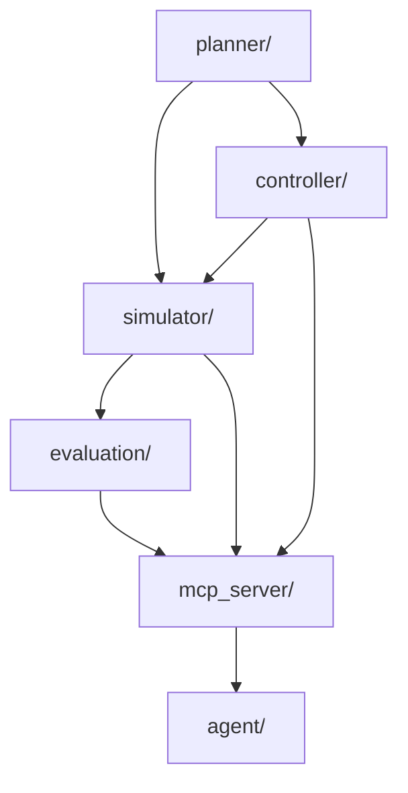

# Architecture Details

## Module Dependency Graph



## Planner → Controller Interface

Planner xuất trajectory DataFrame:
```
columns: [t, x_ref, y_ref, yaw_ref, v_ref]
```
Controller nhận reference trajectory và trả control signal `[steer, accel]`.

## Controller → Simulator Interface

Controller trả `(control, status)` mỗi bước. Simulator:
1. Nhận control `[steer, accel]`
2. Gọi `vehicle_model.step(state, control)`
3. Kiểm tra collision với environment
4. Ghi log

## Simulator → Evaluation Interface

Simulator xuất:
- `log_df`: DataFrame với columns `[t, x, y, yaw, v, steer, accel, collision, min_obstacle_distance]`
- `summary`: dict với `total_steps, total_time, collision_count, goal_reached`

Evaluation nhận log + reference trajectory, tính metrics.

## MCP Server Interface

Mọi tool call qua `server.call(tool_name, **kwargs)` trả dict:
```python
{"status": "success"|"error"|"rejected", "metrics": {...}, "error": "..."}
```
